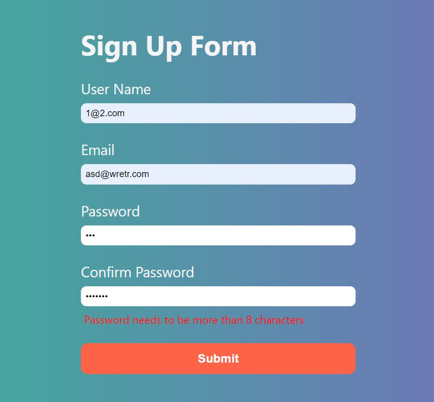

# ⭐ Project - Complete Form Validation ⭐

This  project of javascript is made from pure HTML,CSS and Javascript.

I got this assignment from iNeuron Bootcamp.

 

📌 Learnings:

👉 1\. Event Listeners and DOM Manipulation 
👉 2\. Logic behind applying different validations for the form.  
👉 3\. Use of nextElementSibling property 

 

> Time taken to build this project is 3 hr.

  

## Links

[Link](https://javascriptmyformvalidationapp.netlify.app/)

[Linkedin](https://www.linkedin.com/in/pratyush-kesarwani-2b6601171/)

### Acknowledgements:

I am thankful to Hitesh Choudhary sir, Anurag sir and iNeuron team for this amazing bootcamp.
